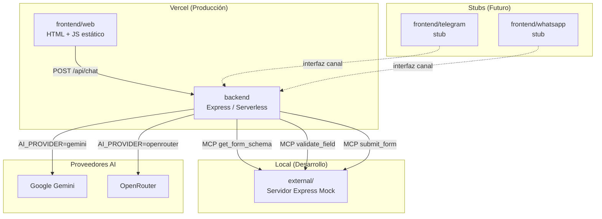
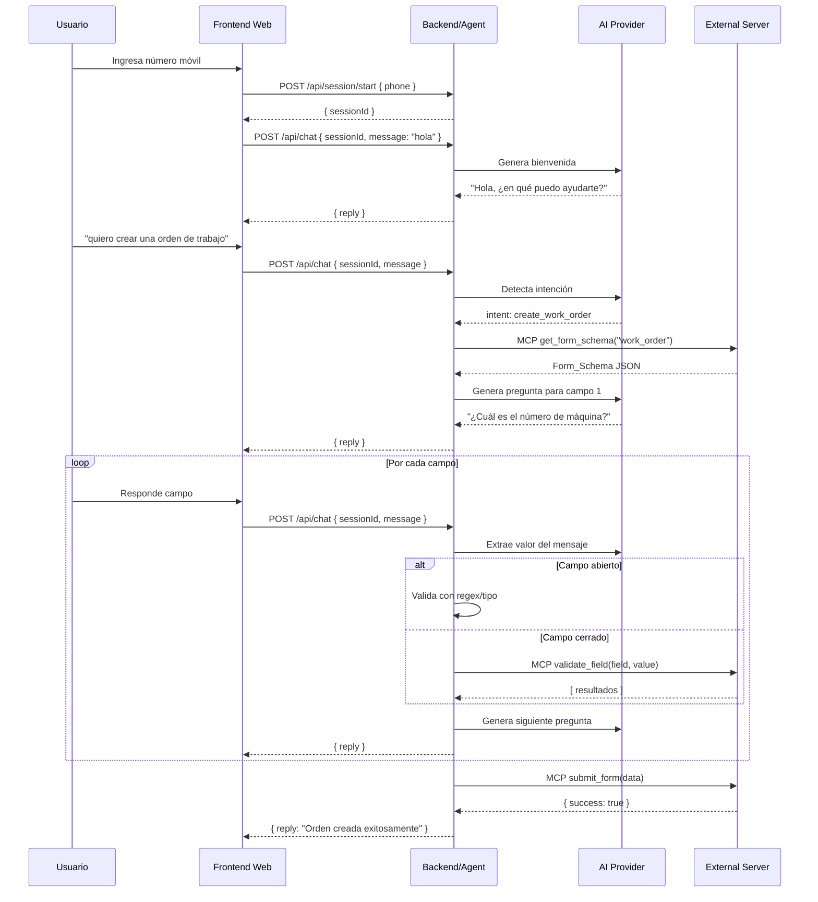

# Documento de Diseño Técnico: AI Form Agent

## Visión General

El AI Form Agent es un sistema conversacional que guía a los usuarios en el llenado de formularios paso a paso mediante chat. El MVP implementa la creación de Órdenes de Trabajo para reparación de máquinas.

El sistema está compuesto por:
- **Frontend web**: interfaz de chat accesible desde el navegador
- **Backend**: agente de AI con MCPs para comunicarse con el sistema externo
- **Servidor externo mock**: servidor Express independiente que simula el sistema externo
- **Stubs de canales futuros**: estructura preparada para Telegram y WhatsApp

El backend y el frontend web se despliegan en Vercel. El servidor externo solo opera en entorno local.

---

## Arquitectura

### Diagrama de capas



### Flujo principal de conversación



---

## Estructura de Directorios

```
ai-form-agent/
├── backend/
│   ├── api/
│   │   ├── chat.js          # Endpoint POST /api/chat
│   │   └── session.js       # Endpoint POST /api/session/start
│   ├── agent/
│   │   ├── agent.js         # Orquestador principal del agente
│   │   ├── intentDetector.js
│   │   └── fieldProcessor.js
│   ├── mcp/
│   │   ├── mcpClient.js     # Cliente MCP genérico
│   │   ├── getFormSchema.js
│   │   ├── validateField.js
│   │   └── submitForm.js
│   ├── providers/
│   │   ├── aiProvider.js    # Factory de proveedores AI
│   │   ├── gemini.js
│   │   └── openrouter.js
│   ├── session/
│   │   ├── sessionStore.js  # Interfaz de sesión
│   │   └── memoryStore.js   # Implementación en memoria
│   └── vercel.json
├── frontend/
│   ├── web/
│   │   ├── index.html       # Pantalla de ingreso de número
│   │   ├── chat.html        # Pantalla de chat
│   │   ├── css/styles.css
│   │   └── js/
│   │       ├── phone.js     # Lógica pantalla de número
│   │       └── chat.js      # Lógica pantalla de chat
│   ├── telegram/
│   │   └── README.md        # Stub - no implementado en MVP
│   └── whatsapp/
│       └── README.md        # Stub - no implementado en MVP
└── external/
    ├── server.js            # Servidor Express mock
    ├── config/
    │   ├── form_schema.json # Esquema de Orden de Trabajo
    │   └── responses.json   # Respuestas configurables
    └── package.json
```

---

## Componentes e Interfaces

### 1. Frontend Web

Dos pantallas HTML estáticas:

**Pantalla de número móvil** (`index.html`):
- Input de número móvil con validación de formato
- Al confirmar, llama `POST /api/session/start` y redirige a `chat.html?sessionId=...`

**Pantalla de chat** (`chat.html`):
- Interfaz de chat clásica (burbuja de mensajes)
- Lee `sessionId` de query params
- Envía mensajes a `POST /api/chat`
- Muestra respuestas del agente en tiempo real

### 2. Backend — Agent

El `agent.js` es el orquestador central. Recibe un mensaje y una sesión, y retorna la respuesta del agente.

```javascript
// Interfaz del Agent
async function processMessage(session, userMessage) -> { reply: string }
```

Internamente el agente:
1. Agrega el mensaje al historial de la sesión
2. Determina el estado actual (sin formulario / llenando formulario)
3. Si no hay formulario activo: detecta intención con AI
4. Si hay formulario activo: procesa el campo actual
5. Genera la respuesta con AI y la retorna

### 3. MCPs

Cada MCP es una función async que llama al servidor externo via HTTP:

```javascript
// mcp/getFormSchema.js
async function getFormSchema(formType) -> FormSchema

// mcp/validateField.js
async function validateField(fieldName, value) -> ValidationResult[]

// mcp/submitForm.js
async function submitForm(formData) -> { success: boolean, id?: string }
```

La URL base del servidor externo se configura via `EXTERNAL_SERVER_URL` en `.env`.

### 4. Proveedores AI

Factory que retorna el proveedor configurado:

```javascript
// providers/aiProvider.js
function getAIProvider() -> AIProvider

// Interfaz AIProvider
async function chat(messages, tools?) -> { content: string, toolCalls?: ToolCall[] }
```

Ambos proveedores (Gemini y OpenRouter) implementan la misma interfaz. La selección se hace al iniciar el servidor leyendo `AI_PROVIDER` del entorno.

### 5. Session Store

Interfaz de almacenamiento intercambiable:

```javascript
// Interfaz SessionStore
async function getSession(sessionId) -> Session | null
async function saveSession(sessionId, session) -> void
async function deleteSession(sessionId) -> void
```

La implementación MVP (`memoryStore.js`) usa un `Map` en memoria. Una futura implementación Firebase reemplazaría este módulo sin tocar la lógica del agente.

### 6. Servidor Externo Mock

Servidor Express independiente con tres endpoints:

| Método | Ruta | Descripción |
|--------|------|-------------|
| GET | `/form-schema/:type` | Retorna el Form_Schema del tipo indicado |
| POST | `/validate-field` | Valida un valor para un campo dado |
| POST | `/submit-form` | Recibe y persiste un formulario completo |

Las respuestas se configuran en `config/responses.json`, permitiendo simular distintos escenarios sin modificar código.

---

## Modelos de Datos

### Session

```javascript
{
  sessionId: string,          // UUID generado al crear la sesión
  phone: string,              // Número móvil del usuario
  channel: string,            // "web" | "telegram" | "whatsapp"
  history: [                  // Historial de mensajes para el AI
    { role: "user" | "assistant", content: string }
  ],
  formState: {                // null si no hay formulario activo
    formType: string,         // ej. "work_order"
    schema: FormSchema,       // Esquema completo del formulario
    currentFieldIndex: number,
    collectedValues: {        // { fieldName: value }
      [fieldName]: any
    }
  } | null,
  createdAt: number,          // timestamp
  updatedAt: number
}
```

### FormSchema

```javascript
{
  formType: string,
  title: string,
  fields: [
    {
      name: string,
      label: string,
      type: "open" | "closed",
      validation: {
        kind: "text" | "number" | "regex",
        pattern?: string        // Solo para kind: "regex"
      }
    }
  ]
}
```

### ValidationResult

```javascript
{
  value: string,
  label: string,
  metadata?: object
}
```

### Ejemplo: Form_Schema de Orden de Trabajo

```json
{
  "formType": "work_order",
  "title": "Orden de Trabajo",
  "fields": [
    {
      "name": "machine_id",
      "label": "Número de máquina",
      "type": "closed",
      "validation": { "kind": "text" }
    },
    {
      "name": "technician",
      "label": "Técnico asignado",
      "type": "closed",
      "validation": { "kind": "text" }
    },
    {
      "name": "description",
      "label": "Descripción del problema",
      "type": "open",
      "validation": { "kind": "text" }
    },
    {
      "name": "priority",
      "label": "Prioridad",
      "type": "open",
      "validation": { "kind": "regex", "pattern": "^(alta|media|baja)$" }
    }
  ]
}
```

### Variables de Entorno

```bash
# AI Provider
AI_PROVIDER=gemini          # "gemini" | "openrouter"
AI_MODEL=gemini-1.5-flash   # Modelo específico del proveedor

# API Keys
GEMINI_API_KEY=...
OPENROUTER_API_KEY=...

# Servidor externo
EXTERNAL_SERVER_URL=http://localhost:3001

# Servidor externo (puerto)
EXTERNAL_PORT=3001
```


---

## Propiedades de Corrección

*Una propiedad es una característica o comportamiento que debe mantenerse verdadero en todas las ejecuciones válidas de un sistema — esencialmente, una declaración formal sobre lo que el sistema debe hacer. Las propiedades sirven como puente entre las especificaciones legibles por humanos y las garantías de corrección verificables por máquinas.*

### Propiedad 1: Validación de formato de número móvil

*Para cualquier* string que no sea un número móvil con formato válido, la función de validación del frontend debe retornar `false` y no permitir iniciar la sesión.

**Valida: Requerimiento 1.3**

---

### Propiedad 2: Unicidad de sesión por número móvil

*Para cualquier* número móvil válido, el session store no debe permitir que dos sesiones activas compartan el mismo identificador de número móvil en el mismo canal.

**Valida: Requerimiento 1.4**

---

### Propiedad 3: Mantenimiento del historial de conversación

*Para cualquier* sesión activa y cualquier secuencia de mensajes intercambiados, el historial de la sesión debe crecer en exactamente 2 entradas por cada intercambio (1 del usuario + 1 del agente), y nunca perder mensajes previos.

**Valida: Requerimiento 2.3**

---

### Propiedad 4: Inicio de flujo al recibir Form_Schema

*Para cualquier* Form_Schema válido retornado por el MCP `get_form_schema`, el estado de la sesión debe transicionar a `formState` activo con `currentFieldIndex = 0` y el schema almacenado.

**Valida: Requerimiento 3.3**

---

### Propiedad 5: Orden de campos respetado

*Para cualquier* Form_Schema con N campos, el agente debe solicitar los campos en el orden exacto definido en el array `fields` del schema (índice 0 primero, índice N-1 último), sin saltarse ni reordenar campos.

**Valida: Requerimientos 4.3, 4.4**

---

### Propiedad 6: Transición a envío al completar todos los campos

*Para cualquier* Form_Schema con N campos, cuando `currentFieldIndex` alcanza N (todos los campos han sido validados y registrados), el agente debe invocar el MCP `submit_form` con los valores recopilados.

**Valida: Requerimientos 4.5, 8.1**

---

### Propiedad 7: Validación de campo abierto aplica la regla correcta

*Para cualquier* campo abierto con su regla de validación (tipo `text`, `number` o `regex`) y cualquier valor de entrada, la función de validación debe:
- Tipo `text`: aceptar cualquier string no vacío, rechazar strings vacíos o solo espacios
- Tipo `number`: aceptar strings que representen números válidos, rechazar el resto
- Tipo `regex`: el resultado de validar debe ser idéntico a aplicar la expresión regular del schema al valor

**Valida: Requerimientos 5.1, 5.4, 5.5**

---

### Propiedad 8: Avance de índice condicional a validación exitosa

*Para cualquier* campo abierto y cualquier valor de usuario:
- Si el valor es inválido según la regla del campo, `currentFieldIndex` no debe cambiar
- Si el valor es válido, `currentFieldIndex` debe incrementarse en exactamente 1 y el valor debe quedar registrado en `collectedValues`

**Valida: Requerimientos 5.2, 5.3**

---

### Propiedad 9: Comportamiento del agente según resultados del MCP de validación

*Para cualquier* campo cerrado y cualquier respuesta del MCP `validate_field`:
- Si retorna exactamente 1 resultado: `currentFieldIndex` se incrementa en 1 y el valor queda registrado
- Si retorna N > 1 resultados: `currentFieldIndex` no cambia y el agente presenta las N opciones al usuario
- Si retorna 0 resultados: `currentFieldIndex` no cambia y el agente solicita al usuario que ingrese el valor nuevamente

**Valida: Requerimientos 6.3, 6.4, 6.6**

---

### Propiedad 10: Limpieza de formState tras envío exitoso o cancelación

*Para cualquier* sesión con `formState` activo, después de un envío exitoso del formulario o de una cancelación explícita del usuario, `formState` debe ser `null` y el historial de conversación debe mantenerse intacto.

**Valida: Requerimientos 8.4, 9.1, 10.2**

---

### Propiedad 11: Detección de palabras clave de cancelación

*Para cualquier* mensaje del usuario que contenga expresiones de cancelación reconocidas (ej. "cancelar", "empezar de nuevo", "olvidalo", "cancel"), la función de detección de cancelación debe retornar `true`, independientemente de mayúsculas, minúsculas o espacios adicionales.

**Valida: Requerimiento 9.4**

---

### Propiedad 12: Invariante de estructura de sesión

*Para cualquier* sesión creada mediante el session store, el objeto de sesión debe contener siempre los campos: `sessionId`, `phone`, `channel`, `history` (array), `formState` (objeto o null), `createdAt` y `updatedAt`. Ninguna operación de lectura o escritura debe dejar la sesión en un estado con campos faltantes.

**Valida: Requerimiento 10.1**

---

## Manejo de Errores

### Errores de MCP

Todos los MCPs deben manejar errores de red y respuestas inesperadas del servidor externo. Cuando un MCP falla, el agente no debe lanzar una excepción no controlada sino retornar un mensaje de error amigable al usuario.

| Escenario | Comportamiento del Agente |
|-----------|--------------------------|
| `get_form_schema` falla | Informa al usuario y ofrece reintentar |
| `validate_field` falla | Informa al usuario y ofrece reintentar el campo |
| `submit_form` falla | Informa al usuario y ofrece reintentar el envío |
| Timeout de red | Mismo tratamiento que error de MCP |

### Errores de AI Provider

Si el proveedor de AI retorna un error (rate limit, API key inválida, timeout), el agente debe:
1. Registrar el error en consola con contexto suficiente para debugging
2. Retornar un mensaje genérico al usuario indicando que el servicio no está disponible temporalmente
3. No limpiar la sesión — el usuario puede reintentar

### Errores de validación de entrada

- Número móvil inválido: manejado en el frontend antes de llamar al backend
- Sesión no encontrada: el backend retorna HTTP 404 con mensaje descriptivo
- Body de request malformado: el backend retorna HTTP 400

### Estrategia de logging

Todos los errores deben loguearse con:
- Timestamp
- SessionId (si disponible)
- Nombre del MCP o componente que falló
- Mensaje de error original

---

## Estrategia de Testing

### Enfoque dual: tests unitarios + tests basados en propiedades

Los tests unitarios y los tests de propiedades son complementarios. Los unitarios verifican ejemplos concretos y casos de borde; los de propiedades verifican que las invariantes se mantienen para cualquier entrada generada aleatoriamente.

### Tests Unitarios (ejemplos y casos de borde)

Cubren escenarios específicos que no se prestan a generalización:

- Mensaje de bienvenida al iniciar sesión (Req 2.1, 2.2)
- Invocación de MCP al detectar intención (Req 3.2)
- Respuesta del agente cuando MCP falla (Req 3.4, 6.7, 8.3)
- Selección de opción de lista por el usuario (Req 6.5)
- Notificación de envío exitoso (Req 8.2)
- Confirmación de cancelación (Req 9.2)
- Factory de AI provider con `AI_PROVIDER=gemini` y sin variable definida (Req 11.1, 11.5)
- Endpoints del servidor externo retornan estructura correcta (Req 12.1, 12.2, 12.3)
- `vercel.json` excluye el servidor externo (Req 14.3, 14.4)

### Tests Basados en Propiedades

Librería recomendada: **[fast-check](https://github.com/dubzzz/fast-check)** (JavaScript/Node.js)

Cada test de propiedad debe ejecutarse con un mínimo de **100 iteraciones**.

Cada test debe incluir un comentario de trazabilidad con el formato:
`// Feature: ai-form-agent, Propiedad N: <texto de la propiedad>`

| Propiedad | Test | Generadores |
|-----------|------|-------------|
| P1: Validación de número móvil | Genera strings aleatorios, verifica que solo los válidos pasan | `fc.string()`, `fc.integer()` |
| P2: Unicidad de sesión | Genera pares de números, verifica no colisión de IDs | `fc.string()` |
| P3: Mantenimiento de historial | Genera secuencias de mensajes, verifica crecimiento del historial | `fc.array(fc.string())` |
| P4: Inicio de flujo con schema | Genera Form_Schemas válidos, verifica transición de estado | `fc.record(...)` |
| P5: Orden de campos | Genera schemas con N campos, verifica orden de solicitud | `fc.array(fc.record(...))` |
| P6: Transición a envío | Genera sesiones con todos los campos completos, verifica invocación de submit | `fc.record(...)` |
| P7: Validación de campo abierto | Genera valores y reglas, verifica resultado de validación | `fc.string()`, `fc.float()` |
| P8: Avance condicional de índice | Genera campos y valores válidos/inválidos, verifica cambio de índice | `fc.boolean()`, `fc.string()` |
| P9: Comportamiento según resultados MCP | Genera arrays de 0, 1 o N resultados, verifica comportamiento del agente | `fc.array(fc.record(...))` |
| P10: Limpieza de formState | Genera sesiones con formState activo, verifica limpieza tras envío/cancelación | `fc.record(...)` |
| P11: Detección de cancelación | Genera variantes de palabras clave con mayúsculas/espacios, verifica detección | `fc.string()` |
| P12: Invariante de estructura de sesión | Genera operaciones sobre el store, verifica estructura completa | `fc.commands(...)` |

### Cobertura objetivo

- Lógica de validación de campos: 100%
- Lógica de estado del agente (formState transitions): 100%
- MCPs (con mocks del servidor externo): 90%
- AI Provider factory: 100%
- Session store: 100%
